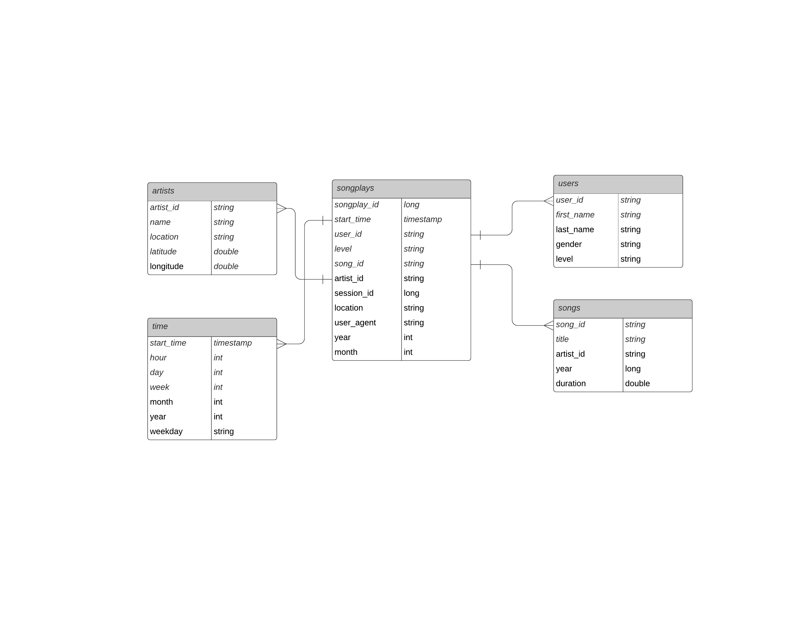

# Summary of the project
A music streaming startup Sparkify, has grown their user base and song database and want to move their data warehouse to data lake. This project uses AWS to build an ETL pipeline that extracts their data from S3, processes them using Spark, and loads the data back into S3 as a set of dimensional tables. 

# Database Schema
Fact table: songplays
Dimention tables: users, songs, artists, time  

# How to run Python scripts
- create emr instance, connect to master node using SSH
- Use scp command to submit etl.py and dl.cfg to the EMR instance created
- In Putty, run spark-submit etl.py

# Explanation of the files
- etl.py reads song_data and log_data from S3, transforms them to create five different tables, and writes them to partitioned parquet files on S3
- dl.cfg contains AWS credentials

# Resource and helpful link
- https://www.c-sharpcorner.com/article/difference-between-pem-and-ppk/#:~:text=PEM%20(Privacy%20Enhanced%20Mail)%20is,for%20encoding%20keys%20and%20certificates.%20.&text=PPK(Putty%20Private%20Key)%20is,have%20to%20convert%20it%20to%20.
- https://knowledge.udacity.com/questions/203246
